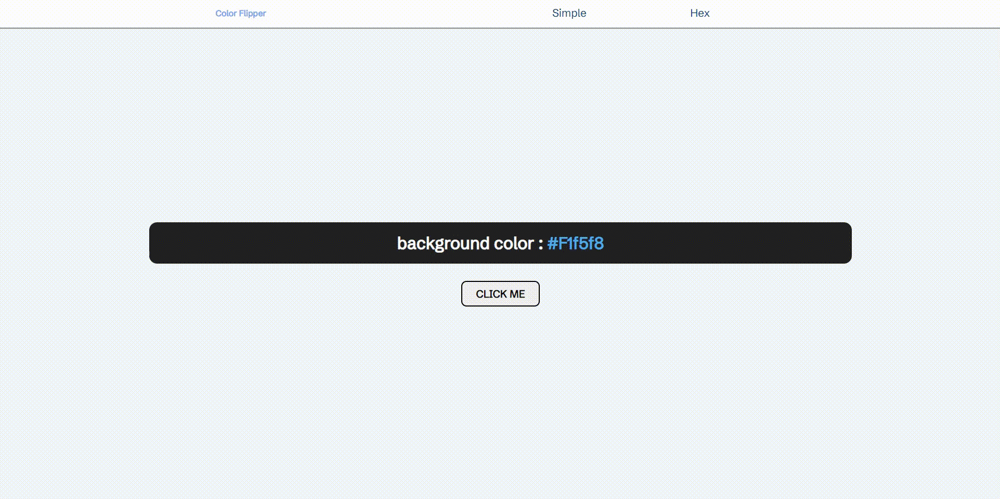

# Color Flipper 만들기

초보자를 위한 40가지 자바스크립트 프로젝트 결과물을 참고하여 Color Flipper를 제작하였다.

| 구현 방법                           | 구현 여부 |
| :---------------------------------- | :-------: |
| arrays                              |     O     |
| document.getElementById             |     O     |
| document.querySelector              |     O     |
| addEventListener                    |     O     |
| document.body.style.backgroundColor |     O     |
| Math.floor                          |     O     |
| Math.random                         |     O     |
| array.length                        |     O     |
